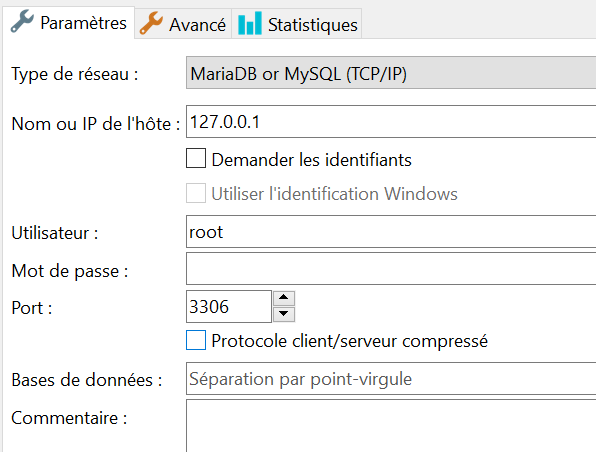

# Module 164 Grégory Gilliéron INFO1B 2023.06.4

Pour commencer à utiliser mon interface, il va vous falloir plusieur logiciel ansi que mon projet.

1. Installer Python en version 3.10 ou 3.11 (https://www.python.org/downloads/)

2. installer pycharme version 2022.2.2 (https://www.jetbrains.com/pycharm/download/)

3. Installer laragon (https://laragon.org/download/index.html)

4. Télecharger mon projet en .zip ou le récuperer depuis github (https://github.com/gregglrn/gillieron_gregory_moto_info1B)

5. Ouvrir laragon, cliquer sur "Start all" puis sur "Database", vous allez devoir crée une nouvelle session en cliquant sûr "Ajouter" si vous n'en avez pas et vous pouvez l'appelé comme vous voulez.
Ensuite vous pouvez ouvrir votre session, par contre il faut que vous ayez ses paramètres:

Puis crée une base de donnée nomée: "gillieron_gregory_bd_info1b"

6. Dézipper le fichier .zip ou se trouve le projet

7. Ouvrez pycharm et ouvrez le projet

8. Copier le fichier dump qui se trouve dans APP_MOTO_164/database/dump_gillieron_gregory_info1b_moto_164.sql

9. Dans laragon coller le dump dans "Requete" puis lancer le afin de copier la base de donnée

10. lancer le fichier dans pycharm APP_MOTO_164/database/1_ImportationDumpSql.py

11. lancer le fichier APP_MOTO_164/database/2_test_connection_bd.py

12. lancer run_mon_app.py

13. cliquer sur l'adresse IP qui s'affiche dans la Consol

14. vous vous trouvez désormais sur l'interface web